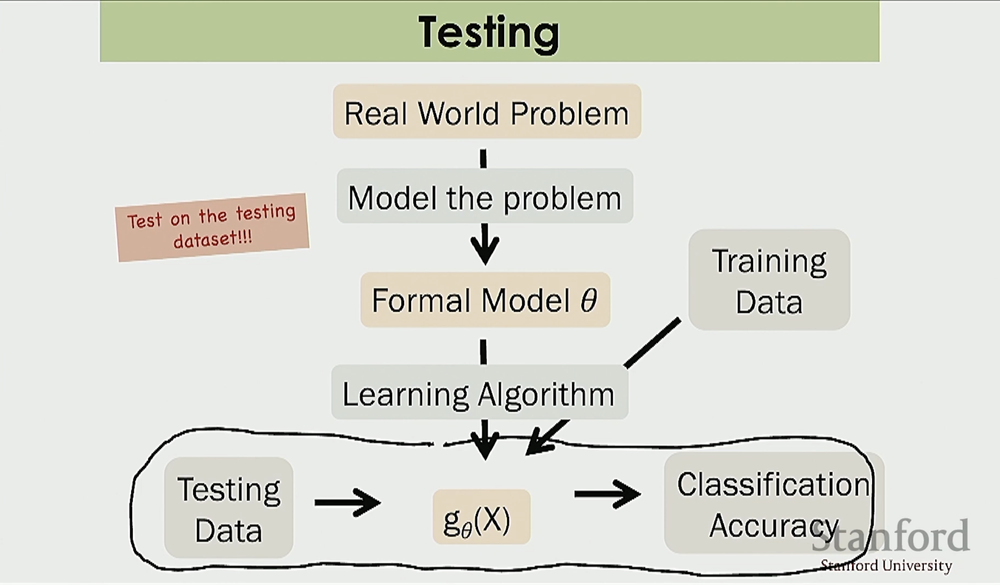

ML Notes
- 
Bias Variance & Regularization

The five-step process that the authors propose in the paper [Prediction of Advertiser Churn for Google AdWords](https://research.google/pubs/prediction-of-advertiser-churn-for-google-adwords/):

1. Select samples for analysis
2. Define churn and select features (potential explanatory variables)
3. Process data: transform features and impute missing values
    - The goal of the third step is to generate more discriminating/relevant features to predict churn. This can be done via linear or non-linear transformations. Some examples are PCA, LDA, data preprocessing. 
4. Build predictive models
5. Evaluate trained models



#### Bias Variance

- **Underfitting: High Bias**
- **Overfitting: High Variance**
- Think of **bias** in ML as a algorithm's preconception of the shape of the model.
- Think of **variance** in ML as how much the model might change based on new data. For a regression model, if it's overfit on your dataset, then new data will lead to a wildly different model.
- Workflow: Fit an algorithm that's "quick & dirty" then understand whether it's high bias or high variance and improve it.
- Regression models & Classification models are both subject to bias variance.

#### Regularization

The **Linear Regression Objective Function** ("Least Squares Cost Function") is:

$\min_{\theta}\; \frac{1}{2}\sum_{i=1}^{m}\left\|y^{(i)}-\theta^{T}x^{(i)}\right\|^{2}$

- $\min_{\theta}$: Choose a $\theta$ that minimizes the total squared residual magnitude across all training examples.
- $\frac{1}{2}$ doesn't change the minimizer, and is included for algebraic convenience (to get rid of the factor of 2 when differentiating a squared term)
- $\sum_{i=1}^{m}$ is the sum across $m$ training examples
- With linear regression, the **predictor** $\hat{y}^{(i)}$ is the dot product $\theta^{T}x^{(i)}$. This is the guess of the model. It is **linear with the parameters** in that $\theta$ only appears to the first power. This is very important! Optimization becomes harder (you can use gradient descent for local minima) with non-linear parameters.
- If $y^{i} \in \mathbb{R}$ (a **scalar output**), then the **Euclidean norm** $\left\| \right\|$ is redundant (you can use $(...)$ instead). 
- But given that $y^{i} \in \mathbb{R}^{k}$ (a **vector output**), then you need the Euclidean norm.

To add **Regularization**, you add a **regularization term**:

$\min_{\theta}\; \frac{1}{2}\sum_{i=1}^{m}\left\|y^{(i)}-\theta^{T}x^{(i)}\right\|^{2} + \lambda\left\|\theta\right\|^{2}$

Sometimes you write multiply $\lambda$ by $\frac{1}{2}$ to make derivation easier:

$\min_{\theta}\; \frac{1}{2}\sum_{i=1}^{m}\left\|y^{(i)}-\theta^{T}x^{(i)}\right\|^{2} + \frac{\lambda}{2}\left\|\theta\right\|^{2}$

- The advantage of adding a small $\lambda$ (say, $\lambda = 1$) is that it penalizes $\theta$ from being too big. Therefore, *it makes it harder for the learning algorithm to overfit the data*.
- If $\lambda$ is too big (say, $\lambda = 1000$), however, you risk underfitting the data.

```{python}
#| eval: false


```

Personal Notes
-
- Self-directed projects are hard to understand where to begin, so I read two papers for examples of Classification: [Prediction of Advertiser Churn for Google AdWords](https://research.google/pubs/prediction-of-advertiser-churn-for-google-adwords/) and [Building Airbnb Categories with ML and Human-in-the-Loop](https://medium.com/airbnb-engineering/building-airbnb-categories-with-ml-and-human-in-the-loop-e97988e70ebb).
- For the AdWords paper, I found it interesting that the definition of "customer churn" was not well-defined. 
- The challenge with top-down learning is that groping around in the dark can be incredibly demotivating. Watching the Stanford lectures felt like a breath of fresh air. I was also able to focus more effectively than just openly learning. Seems like the optimal balance is to have both.

- Used [Andrew Ng's lectures on data splits](https://www.youtube.com/watch?v=rjbkWSTjHzM&list=PLoROMvodv4rMiGQp3WXShtMGgzqpfVfbU&index=8) to understand how to split data for my project.
- Used [Chris Piech's lecture](https://www.youtube.com/watch?v=ILqZWvDWKEc) to understand Logistic Regression.

Questions I still have
- 
- 


Tomorrow's plan
- 
- 