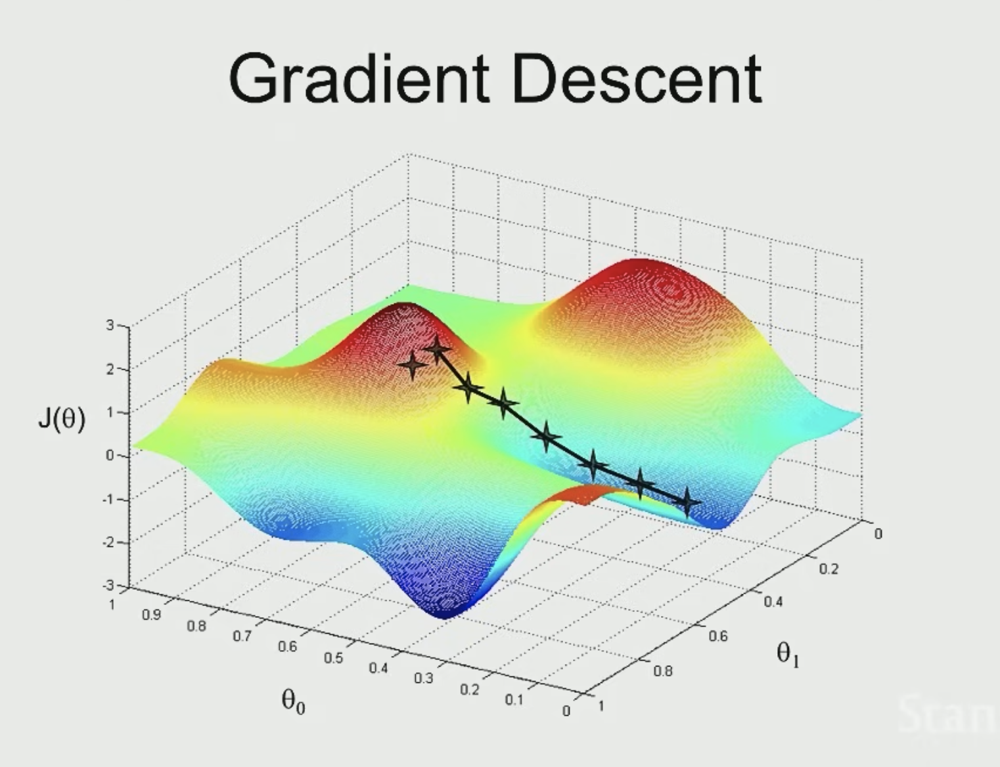

ML Notes
- 
Linear Regression, Batch & Stochastic Gradient Descent

#### Linear Regression Refresher

- Perhaps the simplest supervised learning algorithm
- In simple terms:

1. Training Set 
2. Generate Learning Algorithm
3. Generate $h$ (hypothesis) that takes an input and generates an output

$h$ is typically represented as:
$$
h(x) = \theta_{0} + \theta_{1}x_{1} + \theta_{2}x_{2}...
$$

or:

$$
h(x) = \sum_{i=0}^{n}\theta_{i}x_{i}$ where $x_{0} = 1
$$ 

(i.e., $x_{0}$ is a dummy feature)

If $\theta$ are "parameters" then the job of the learning algorithm is to choose great parameters.

::: callout-note
$(x^{(i)}, y^{(i)})$ is the $i$th training example for $x$ and $y$.

$(x^{(i)}_1, y^{(i)}_1)$ is the 1st feature of the $i$th training example for $x$ and $y$.
:::

Now given that the goal is to choose $\theta$ such that $h(x)$ is close to $y$ for the training examples, the **cost function for linear regression** (also called the Mean Squared Error or Least Squares Cost) is:

$$
J(\theta) = \frac{1}{2m} \sum_{i=1}^{m} (h_\theta(x^{(i)}) - y^{(i)})^2
$$

where:

- $J(\theta)$: the cost to minimize
- $m$: number of training examples
 - $h_\theta(x^{(i)})$: prediction using current parameters $\theta$ on input $x^{(i)}$
 - $y^{(i)}$: true value for the $i$th example

The $\frac{1}{2}$ keeps the derivative clean when the square is expanded, and the $\frac{1}{m}$ averages the summed errors so the scale stays consistent as more data is added.

This function measures how well our linear model with parameters $\theta$ fits the training data. The goal of learning is to find $\theta$ that minimizes $J(\theta)$.

#### Batch Gradient Descent

Gradient Descent has already been covered, but wanted to highlight that the axes are very important here.

The algorithm is as follows:

$$
\theta_{j} := \theta_{j} - \alpha \frac{\partial}{\partial \theta_{j}} J(\theta)
$$

for each parameter $\theta_j$ (for $j = 0, 1, ..., n$):

Repeat until convergence:  
$$
\quad \theta_{j} := \theta_{j} - \alpha \frac{1}{m} \sum_{i=1}^{m} \left( h_\theta(x^{(i)}) - y^{(i)} \right)x^{(i)}_j
$$

Where:  

- $\alpha$ is the learning rate  
- $J(\theta)$ is the cost function  
- $h_\theta(x^{(i)})$ is the model prediction for example $i$  
- $y^{(i)}$ is the true label for example $i$  

- Note that this updated, correct algorithm is a *sum* of the training examples. This is called **Batch Gradient Descent**. 
- Batch Gradient Descent processes all of the data in one batch.
- If the dataset is too large, the single step of gradient descent can become slow (you have to scan through $m$ examples).
- If you see the cost function $J(\theta)$ increasing rather than decreasing, that is a good sign that $\alpha$ the learning rate is too large.
- You "stop" Gradient Descent when you plot the cost function $J(\theta)$ and don't notice any changes

#### Stochastic Gradient Descent

- This solves the problem of progress being prohibitively slow with a large dataset with Batch Gradient Descent
